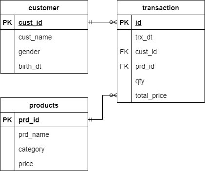
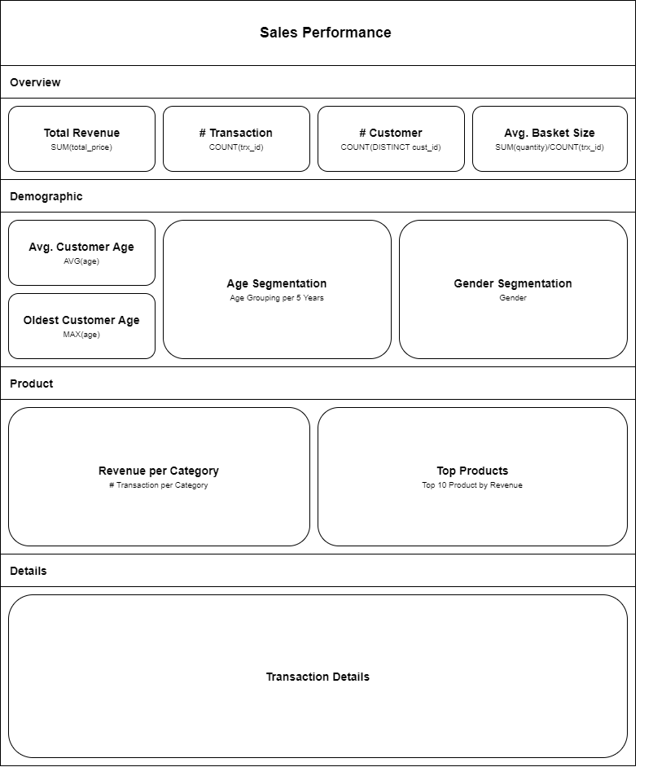

# Project 02: Business Intelligence

## Description
*Company XYZ* is new uprising online retail startups. One of Business Analyst in *Company XYZ* task is to create sales performance. As their business grow, they start to feel the need of automated data-driven decision. CDO of *Company XYZ* approach you, a Data Engineer, to help him building Business Intelligence that can show *Company XYZ* sales performance.

You will be given sample data with same structure with their production level database. They also provided you will sample dashboard mockup for you to replicated. You will be using **Google Data Studio** as BI Tools

 

## Documentation
Data will be stored in **Public Access Google Spreadsheet**.
- [Digital Skola - Project 02 - Data](https://docs.google.com/spreadsheets/d/18MjFaBP191dH2hzSOE-vcyfGuYbM6MfAKgRF7CgGQ8Q/edit#gid=1829355563)

 

### ERD

 

### Data Description

**customers**
|Name|Type|Key|Description|
|---|---|---|---|
|cust_id|integer|PK|Customer unique ID|
|cust_nm|string||Customer full name|
|gender|string||Customer gender (male/female)|
|birth_dt|date||Customer birth date|

 

**products**
|Name|Type|Key|Description|
|---|---|---|---|
|prd_id|integer|PK|Product unique ID|
|prd_name|string||Product name|
|category|string||Product category|
|price|integer||Product single price (base)|

 

**transactions**
|Name|Type|Key|Description|
|---|---|---|---|
|id|integer|PK|Transaction unique ID|
|trx_dt|string||Transaction date|
|cust_id|integer|FK|Customer reference ID|
|prd_id|integer|FK|Product reference ID|
|qty|integer||Transaction total quantity|
|total_price|integer||Transaction total price|

 

**Dashboard Mockup**
 

 

## Requirements
- Create automated **Sales Performance Report**

## Tasks
- Create Data Connection from Data Studio to Google Spreadsheet.
- Create all of dashboard tiles described on Dashboard Mockup.

To view this project solution, access this [link](./solution).