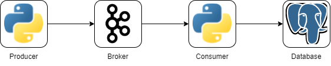

# Project 06: Real-time Processing

## Solution

**Deployed Architecture**

<br>



**How to Deploy (Docker)**

1. Start all services with `docker-compose` (in detach mode)
```sh
docker-compose up -d
```

2. Create topic in **Kafka** instance
```sh
docker exec -d rtp-kafka-1 bash -c '/opt/bitnami/kafka/bin/kafka-topics.sh --create --topic $KAFKA_TOPIC --bootstrap-server localhost:9092'
```

3. Start running **Producer** instance
```sh
docker exec -d rtp-producer-1 bash -c 'python main.py --worker 5 --bootstrap-server $KAFKA_HOST --topic $KAFKA_TOPIC'
```

4. Start running **Consumer** instance
```sh
docker exec rtp-consumer-1 bash -c 'python main.py --bootstrap-server $KAFKA_HOST --topic $KAFKA_TOPIC --tablename ecommerce_tracker'
```

5. Check data in **Postgres** instance in table `ecommerce_tracking`