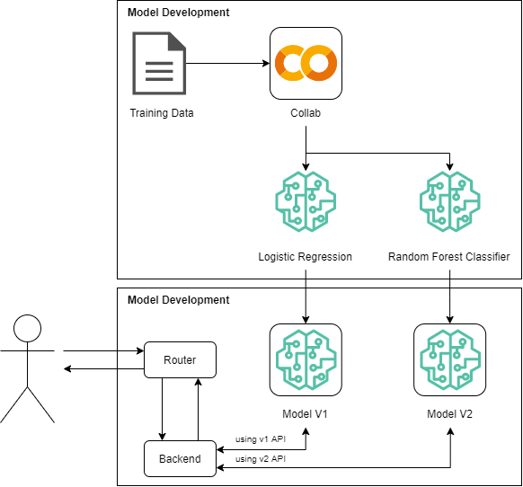

# Project 07: DataOps and MLOps

## Solution

**Deployed Architecture**

<br>



<br>

**Model Training**

There are 2 models generated:
1. Logistic Regression
2. Random Forest Classifier

Model deployed as `joblib` package (including data-processing pipeline).

Full notebook in [Project 07 - Loan Eligibility](https://colab.research.google.com/drive/1GLs2kFbtL5WKaLlYNuxu-4T5yEqP_fcW?usp=sharing)

<br>

**Model Deployment**

`FastAPI` is used to build API interface. Below are the code sctructure:

<br>

```sh
├── api                             # API modules definition
│    ├── v1                         # API v1 (using Logistic Regresssion)
│    │   ├── classifier             # API v1 classifier joblib directory
│    │   │   └── model_lr.joblib    # API v1 Model exported object
│    │   ├── backend.py             # API v1 Logical function
│    │   └── routers.py             # API v1 Routing
│    └── v2                         # API v1 (using Logistic Regresssion)
│        ├── classifier             # API v1 classifier joblib directory
│        │   └── model_rf.joblib    # API v1 Model exported object
│        ├── backend.py             # API v1 Logical function
│        └── routers.py             # API v1 Routing
├── modules                         # Utility or extensions modules
│    └── data_models.py             # Data Models definition for API
├── Dockerfile                      # Docker Image blueprint
├── main.py                         # Main script
├── requirements.txt                # Python library requirements
└── docker-compose.yaml             # Docker Compose definitions
```

<br>

**Script Description**

1. `main.py` is the main interface, where the routes are defined. Routes are path or URL that can be accessed in API. In `main.py`, routers are imported from respective `api`, such as `api.v1.routers` (see `api/v1/routers` to find router definition).

2. `api` is collection of API backend, organized by its version. Each version consist of:
    - `classifier`: directory for model in joblib format.
    - `backend.py`: logical definition or functionality.
    - `routers.py`: router/url definition.

3. Route in `routers.py` will need at least 2 things: `path` (like `/predic`) and input format (like `dm.UserInput`). Input format will validate and acquire data on request (see `modules/data_model.py` to find input format structure in Pydantic model).

4. In `backend.py`, request are processed by taking its input (body data) and use it to predict result. Model are imported from `classifier` directory with joblib modules.

<br>

**Data Input**

|Key|Data Type|Description|
|---|---|---|
|Gender|str|Male/Female|
|Married|str|Choices: Yes/No|
|Dependents|str|Number of dependents|
|Education|str|Applicant Education (Graduate/Under Graduate)|
|Self_Employed|str|Self employed (Y/N)|
|ApplicantIncome|int|Applicant income|
|CoapplicantIncome|int|Coapplicant income|
|LoanAmount|int|Loan amount in thousands|
|Loan_Amount_Term|int|Term of loan in months|
|Credit_History|int|Credit history meets guidelines|
|Property_Area|str|Urban/Semi Urban/Rural|

**Available Routes**

1. Predict with *Logistic Regression*: `localhost:80/api/v1/predict`
2. Predict with *Random Forest Classifier*: `localhost:80/api/v2/predict`

<br>

**Example of Data Input**

```json
{
    "Gender": "Male",
    "Married": "Yes",
    "Dependents": 1,
    "Education": "Graduate",
    "Self_Employed": "No",
    "ApplicantIncome": 3000,
    "CoapplicantIncome": 1000.0,
    "LoanAmount": 200.0,
    "Loan_Amount_Term": 360.0,
    "Credit_History": 1.0,
    "Property_Area": "Semiurban"
}
```

**Documentation**

FastAPI auto-generate documentations can be accessed on [http://localhost:80/docs](http://localhost:80/docs)

You can also import [Postman Collection](./docs).